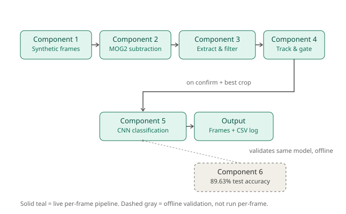

# Conveyor Defect Detection

A real-time computer vision pipeline for automated visual inspection on a
conveyor line: background subtraction, morphological feature extraction,
Kalman tracking, and CNN-based defect classification. (**On going project**)

## Architecture



Frames flow through MOG2 background subtraction, feature extraction,
Kalman tracking, and CNN classification. The CNN's standalone accuracy is
validated separately (offline) against a held-out NEU test set.

## Results

- 89.63% test accuracy on held-out NEU defect images
- 34/34 frames correctly tracked through real clutter (up to 18 simultaneous blobs)
- Live pipeline tracks and correctly classifies the real defect end to end

## How to run

```bash
conda activate conveyor
python -m src.conveyor_generator.scratch_v0   # generate synthetic frames
python -m src.pipeline.integrate              # run the full pipeline
python -m pytest tests -v                     # run tests
```